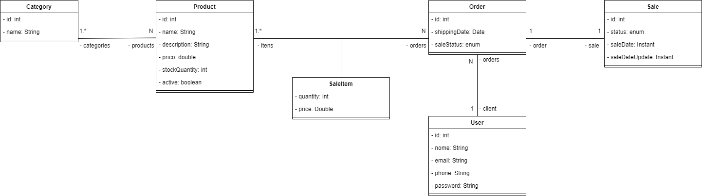

<h1 align="center">
    <p>e-commerce - Projeto Compass Uol<p>
</h1>

## [Sobre](#sobre) 📖
O projeto consiste no desenvolvimento de uma estrutura para um eCommerce, utilizando as
tecnologias e conhecimentos aprendidos no curso.

## [Configuração de Ambiente](#Configuração de Ambiente) 🖥️

<h3>1. Clone o repositório em sua máquina.</h3>


```bash
#Clone

$git clone https://github.com/Bruna-Leticia12/ecommerce-project
```
<br>
<h3> 2. Instale as Dependências:</h3>


- Utilize o Maven para baixar todas as dependências necessárias:

``` 
mvn clean install
```
<br>
<h3>3. Configure o Banco de Dados:</h3>

- Certifique-se de que o MySQL está em execução na porta padrão 3306.
- Crie um esquema no MySQL Workbench chamado ecommerce-db e utilize as seguintes credenciais:

```
CREATE SCHEMA `ecommerce-db`;
```
```
   Usuário: seu_usuario
   Senha: sua_senha
```
 - Conecte-se ao banco de dados através do MySQL Workbench usando as configurações acima.

   <h4>3.1. Testando a Conexão com o Banco de Dados <h4>
 - Após iniciar a aplicação, verifique se as tabelas foram criadas no esquema ecommerce-db utilizando o MySQL Workbench. 
Você pode executar consultas para verificar se a conexão e a configuração estão funcionando corretamente.


<br>
<h3>4. Configure o Arquivo application.properties:</h3>

- Certifique-se de que as configurações do arquivo application.properties correspondem às suas credenciais e URL do banco de dados.:

```
spring.application.name=ecommerce
spring.datasource.url=jdbc:mysql://localhost:3306/ecommerce-db?useSSL=false&serverTimezone=UTC
spring.datasource.username=seu_usuario
spring.datasource.password=sua_senha
spring.datasource.driver-class-name=com.mysql.cj.jdbc.Driver

spring.jpa.hibernate.ddl-auto=update
spring.jpa.properties.hibernate.dialect=org.hibernate.dialect.MySQL8Dialect
```

<h3> 5.Execute a Aplicação:</h3>

- Você pode iniciar a aplicação utilizando o comando Maven:
```
mvn spring-boot:run
```

 <h3 align="center">

<br>
<h3>6. Funcionalidades.</h3>

- Produtos : Criar, ler, atualizar e excluir produtos. Validações: O preço do produto deve ser positivo. Um produto não pode ser deletado se já estiver incluído em uma venda, mas pode ser inativado.
Controle de estoque: um produto não pode ser vendido se a quantidade em estoque for menor que a quantidade necessária para a venda.
- Vendas: Criar, ler, atualizar e excluir vendas. Uma venda deve ter pelo menos um produto para ser concluída. Filtros e Relatórios: Filtro de vendas por data.
Relatórios de vendas mensal e semanal.
- Cache
- Tratamento de Exceções

## [Diagrama - ER](#Diagrama-ER)





## [Ferramentas](#Ferramentas)🔧

- [Spring Boot 3.3.1](https://spring.io/projects/spring-boot)
- Java 17
- Spring Data JPA
- MySQL
- Maven
<br>
